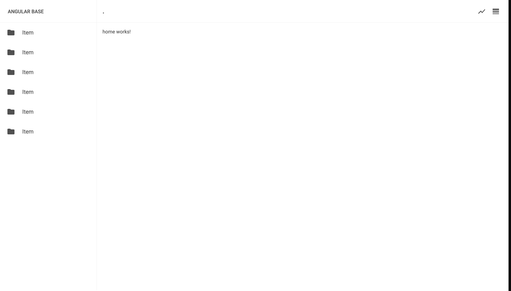

# AngularBase

Basic project used for quickly cloning to test things out

```
git clone https://github.com/IsaacSomething/angular-base.git
```

```
cd angular-base/ && npm install
```

Or join [codeflow](https://stackblitz.com/codeflow/beta) | [short overview](https://www.youtube.com/watch?v=b7C_NGgPPTc)

```
https://pr.new/github.com/IsaacSomething/angular-base
```

- "@angular/core": "^14.2.7"
- "@angular/material": "^14.2.5"

#### Branch with-server

Start a simple server on localhost:9000, checkout to branch `with-server`

```
npm run server
```

<br />


